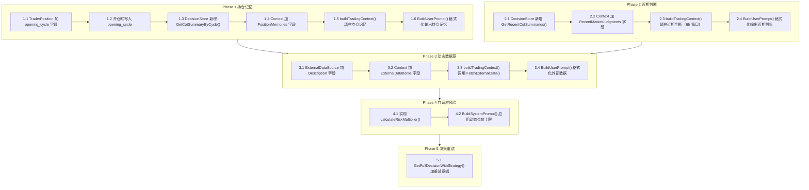

# AI 交易决策增强完整开发方案

## 架构全景图




---

## Phase 1：持仓记忆（Position Memory）

### Task 1.1 — TraderPosition 新增 opening_cycle 字段

**文件**: `[store/position.go](store/position.go)`

在 `TraderPosition` 结构体（第 80 行附近）新增一个字段：

```go
OpeningCycle int `gorm:"column:opening_cycle;default:0" json:"opening_cycle"`
```

同时在 `InitTables()` 的 PostgreSQL 分支（第 127 行附近）新增增量列语句：

```go
s.db.Exec(`ALTER TABLE trader_positions ADD COLUMN IF NOT EXISTS opening_cycle INTEGER DEFAULT 0`)
```

SQLite 走 AutoMigrate，无需额外处理。

**验证**：重启后 `trader_positions` 表包含 `opening_cycle` 列，存量数据默认值为 0。

---

### Task 1.2 — 开仓时写入 opening_cycle

**文件**: `[trader/auto_trader.go](trader/auto_trader.go)`

`recordPositionChange()` 函数（第 2083 行）的 `open_long/open_short` 分支里，`pos` 结构体初始化时加入：

```go
OpeningCycle: at.callCount,
```

`at.callCount` 在每个 `runCycle()` 开始时自增，代表当前决策周期号，与 `decision_records.cycle_number` 一致。

**验证**：新开一个仓后，查 `trader_positions` 表，`opening_cycle` 非 0 且与对应 `decision_records.cycle_number` 吻合。

---

### Task 1.3 — DecisionStore 新增 GetCotSummaryByCycle()

**文件**: `[store/decision.go](store/decision.go)`

在现有查询方法之后新增（参考 `getLatestCoTTraces` 的写法，第 362 行）：

```go
// GetCotSummaryByCycle 根据 traderID + cycleNumber 获取该周期的 CotSummary，用于持仓记忆注入
func (s *DecisionStore) GetCotSummaryByCycle(traderID string, cycleNumber int) string {
    if cycleNumber <= 0 {
        return ""
    }
    var record DecisionRecordDB
    err := s.db.Where("trader_id = ? AND cycle_number = ?", traderID, cycleNumber).
        Select("cot_summary").
        First(&record).Error
    if err != nil {
        return ""
    }
    return record.CotSummary
}
```

**验证**：单元测试验证该方法能按 cycle_number 正确返回 cot_summary，不存在时返回空字符串。

---

### Task 1.4 — kernel.Context 新增 PositionMemories 字段

**文件**: `[kernel/engine.go](kernel/engine.go)`

在 `Context` 结构体（第 111 行）新增字段和辅助结构体：

```go
// PositionMemory 开仓时的决策记忆
type PositionMemory struct {
    Symbol     string // 持仓品种
    Side       string // long/short
    CotSummary string // 开仓时的决策摘要
}
```

在 `Context` 中加入：

```go
PositionMemories []PositionMemory `json:"-"` // 各持仓的开仓记忆，不序列化
```

**验证**：编译通过，结构体定义无冲突。

---

### Task 1.5 — buildTradingContext() 填充持仓记忆

**文件**: `[trader/auto_trader.go](trader/auto_trader.go)`

在 `buildTradingContext()` 的步骤 7（第 948 行，加载近期交易统计后），新增持仓记忆加载逻辑：

```go
// 加载各持仓的开仓记忆（用于 AI 了解当初开仓理由）
for _, pos := range positionInfos {
    if dbPos, err := at.store.Position().GetOpenPositionBySymbol(at.id, pos.Symbol, pos.Side); err == nil && dbPos != nil && dbPos.OpeningCycle > 0 {
        summary := at.store.Decision().GetCotSummaryByCycle(at.id, dbPos.OpeningCycle)
        if summary != "" {
            ctx.PositionMemories = append(ctx.PositionMemories, kernel.PositionMemory{
                Symbol:     pos.Symbol,
                Side:       pos.Side,
                CotSummary: summary,
            })
        }
    }
}
```

**验证**：日志输出 `ctx.PositionMemories` 非空（当持仓有对应 opening_cycle 时）。

---

### Task 1.6 — BuildUserPrompt() 格式化持仓记忆

**文件**: `[kernel/engine.go](kernel/engine.go)`

在 `BuildUserPrompt()` 函数（第 1151 行）的当前持仓段落之前，插入持仓记忆段落：

```go
if len(ctx.PositionMemories) > 0 {
    sb.WriteString("## Position Open Reasoning (your analysis when opening these positions)\n")
    for _, pm := range ctx.PositionMemories {
        sb.WriteString(fmt.Sprintf("- %s %s: %s\n", pm.Symbol, pm.Side, pm.CotSummary))
    }
    sb.WriteString("\n")
}
```

并在 `BuildSystemPrompt()` 的决策过程段落（第 1034 行）补充一行指令：

```
1. Review "Position Open Reasoning" — evaluate whether your original thesis still holds before deciding to hold or close.
```

**验证**：查看 AI 调用时生成的 UserPrompt，包含 "Position Open Reasoning" 段落。

---

## Phase 2：近期市场判断（Recent Market Judgment）

### Task 2.1 — DecisionStore 新增 GetRecentCotSummaries()

**文件**: `[store/decision.go](store/decision.go)`

新增带时间窗口过滤的查询方法（复用已有的 `getLatestCoTTraces` 查询模式）：

```go
// GetRecentCotSummaries 获取指定时间窗口内的最近 N 条决策摘要（按时间从旧到新）
// withinHours: 时间窗口（小时），0 表示不过滤
func (s *DecisionStore) GetRecentCotSummaries(traderID string, withinHours, limit int) []string {
    query := s.db.Where("trader_id = ? AND cot_summary != '' AND success = true", traderID)
    if withinHours > 0 {
        cutoff := time.Now().UTC().Add(-time.Duration(withinHours) * time.Hour)
        query = query.Where("timestamp > ?", cutoff)
    }
    var records []DecisionRecordDB
    query.Order("timestamp DESC").Limit(limit).Select("cot_summary", "timestamp").Find(&records)
    
    result := make([]string, 0, len(records))
    for i := len(records) - 1; i >= 0; i-- { // 反转为从旧到新
        result = append(result, records[i].CotSummary)
    }
    return result
}
```

**验证**：6小时内有记录时返回数据，超过窗口时返回空切片。

---

### Task 2.2 — Context 新增 RecentMarketJudgments 字段

**文件**: `[kernel/engine.go](kernel/engine.go)`

在 `Context` 结构体（第 111 行）加入：

```go
RecentMarketJudgments []string `json:"-"` // 最近 N 小时内的决策摘要（从旧到新）
```

---

### Task 2.3 — buildTradingContext() 填充近期判断

**文件**: `[trader/auto_trader.go](trader/auto_trader.go)`

在持仓记忆加载逻辑之后，新增近期判断加载：

```go
// 加载近期市场判断（6小时内，最多3条）
if at.store != nil {
    ctx.RecentMarketJudgments = at.store.Decision().GetRecentCotSummaries(at.id, 6, 3)
    logger.Infof("📋 [%s] Loaded %d recent market judgments for AI context", at.name, len(ctx.RecentMarketJudgments))
}
```

---

### Task 2.4 — BuildUserPrompt() 格式化近期判断

**文件**: `[kernel/engine.go](kernel/engine.go)`

在 BuildUserPrompt() 账户信息之后（约第 1165 行），插入近期判断段落：

```go
if len(ctx.RecentMarketJudgments) > 0 {
    sb.WriteString("## Your Recent Market Analysis (for continuity)\n")
    for i, judgment := range ctx.RecentMarketJudgments {
        sb.WriteString(fmt.Sprintf("%d. %s\n", i+1, judgment))
    }
    sb.WriteString("Note: Use above as context reference only, not as binding constraints.\n\n")
}
```

**验证**：查看 UserPrompt，包含 "Your Recent Market Analysis" 段落（6小时内有记录时）。

---

## Phase 3：完善动态数据源插件（ExternalDataSource）

> 现状：`ExternalDataSource` 配置和 `FetchExternalData()` 已存在，但未接入 Context 和 Prompt，且缺少 `Description` 字段。

### Task 3.1 — ExternalDataSource 新增 Description 字段

**文件**: `[store/strategy.go](store/strategy.go)`

在 `ExternalDataSource` 结构体（第 195 行）新增两个字段：

```go
Description  string `json:"description,omitempty"`   // AI 解读说明（告知 AI 该数据含义及参考方式）
ContextLabel string `json:"context_label,omitempty"` // 在 Prompt 中的显示标题，留空则用 Name
```

---

### Task 3.2 — Context 新增 ExternalDataItems 字段

**文件**: `[kernel/engine.go](kernel/engine.go)`

新增辅助结构体和 Context 字段：

```go
// ExternalDataItem 单条外部数据源的拉取结果
type ExternalDataItem struct {
    Label       string // 显示标题
    Description string // AI 解读说明
    Data        string // JSON 序列化后的数据内容
}
```

在 `Context` 中加入：

```go
ExternalDataItems []ExternalDataItem `json:"-"`
```

---

### Task 3.3 — buildTradingContext() 接入 FetchExternalData()

**文件**: `[trader/auto_trader.go](trader/auto_trader.go)`

在所有数据加载完毕之后（步骤 11 Price ranking 之后），新增：

```go
// 加载外部数据源（动态插件，通过策略配置，无需代码改动即可新增）
externalRaw, err := at.strategyEngine.FetchExternalData()
if err != nil {
    logger.Infof("⚠️ [%s] Failed to fetch external data: %v", at.name, err)
} else {
    for _, src := range at.strategyEngine.GetConfig().Indicators.ExternalDataSources {
        data, ok := externalRaw[src.Name]
        if !ok {
            continue
        }
        dataBytes, _ := json.Marshal(data)
        label := src.ContextLabel
        if label == "" {
            label = src.Name
        }
        ctx.ExternalDataItems = append(ctx.ExternalDataItems, kernel.ExternalDataItem{
            Label:       label,
            Description: src.Description,
            Data:        string(dataBytes),
        })
    }
}
```

---

### Task 3.4 — BuildUserPrompt() 格式化外部数据

**文件**: `[kernel/engine.go](kernel/engine.go)`

在 BuildUserPrompt() 末尾（candidate coins 之后），新增外部数据段落：

```go
for _, item := range ctx.ExternalDataItems {
    sb.WriteString(fmt.Sprintf("## External Data: %s\n", item.Label))
    if item.Description != "" {
        sb.WriteString(fmt.Sprintf("Context: %s\n", item.Description))
    }
    sb.WriteString(fmt.Sprintf("Data: %s\n\n", item.Data))
}
```

**验证**：在策略配置中添加一个测试数据源，查看 UserPrompt 包含对应的数据段落。

---

## Phase 4：自适应风险预算

### Task 4.1 — 实现 calculateRiskMultiplier()

**文件**: `[kernel/engine.go](kernel/engine.go)`

新增计算函数（可放在 BuildSystemPrompt 附近）：

```go
// calculateRiskMultiplier 根据账户近期表现计算仓位系数（0.5 ~ 1.2）
func calculateRiskMultiplier(stats *TradingStats) float64 {
    if stats == nil || stats.TotalTrades < 5 {
        return 1.0 // 样本不足，不调整
    }
    switch {
    case stats.MaxDrawdownPct > 15:
        return 0.5  // 深度回撤：减半
    case stats.ProfitFactor < 1.0:
        return 0.6  // 持续亏损：降低
    case stats.ProfitFactor >= 1.5 && stats.SharpeRatio >= 1.0:
        return 1.2  // 表现优秀：适度放大
    default:
        return 1.0
    }
}
```

---

### Task 4.2 — BuildSystemPrompt() 应用动态仓位上限

**文件**: `[kernel/engine.go](kernel/engine.go)`

修改 `GetFullDecisionWithStrategy()` 调用 `BuildSystemPrompt()` 时，传入 TradingStats（需调整函数签名接受可选参数），并在 Hard Constraints 段落应用系数：

```go
multiplier := calculateRiskMultiplier(tradingStats)
adjustedAltcoinLimit := accountEquity * altcoinPosValueRatio * multiplier
adjustedBTCETHLimit  := accountEquity * btcEthPosValueRatio * multiplier
```

如果 multiplier != 1.0，在 System Prompt 中添加状态说明：

```
// multiplier < 1.0 时
[Risk Budget Reduced to {multiplier*100}%] Account in drawdown/loss phase. Position limits reduced automatically.
// multiplier > 1.0 时
[Risk Budget Expanded to {multiplier*100}%] Account performing well. Position limits slightly increased.
```

**验证**：在回撤状态下，AI 收到的仓位上限数字低于正常值，Prompt 中包含风险说明。

---

## Phase 5：决策重试

### Task 5.1 — GetFullDecisionWithStrategy() 加重试逻辑

**文件**: `[kernel/engine.go](kernel/engine.go)`

在 `parseFullDecisionResponse` 验证失败后，增加一次携带错误信息的补充调用（最多重试 1 次）：

```go
if err != nil && strings.Contains(err.Error(), "decision validation failed") {
    logger.Infof("⚠️ Decision validation failed, retrying with feedback: %v", err)
    feedbackPrompt := fmt.Sprintf("%s\n\n[CORRECTION REQUIRED] Your previous response had issues: %v\nPlease fix and re-output the decision JSON only.", userPrompt, err)
    retryResponse, retryErr := mcpClient.CallWithMessages(systemPrompt, feedbackPrompt)
    if retryErr == nil {
        decision, err = parseFullDecisionResponse(retryResponse, ...)
        if err == nil {
            logger.Infof("✓ Retry succeeded after feedback correction")
        }
    }
}
```

**验证**：故意传入一个会验证失败的场景（如 R:R 不达标），观察日志出现 "Retrying with feedback" 并在第二次成功。

---

## 执行顺序约束

- Phase 1 和 Phase 2 相互独立，可按顺序各自推进
- Phase 3 依赖 Phase 1、2 完成后验证整体数据流
- Phase 4 依赖 TradingStats 已在 Context 中传递（已有），可独立执行
- Phase 5 完全独立，随时可以单独执行

**每个 Task 完成后需确认：编译通过 + 对应验证项成立，再推进下一个 Task。**